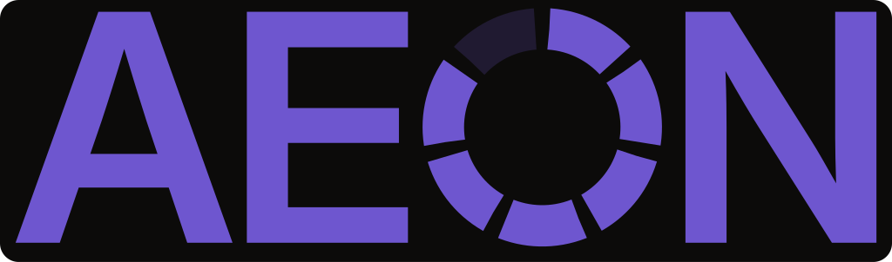
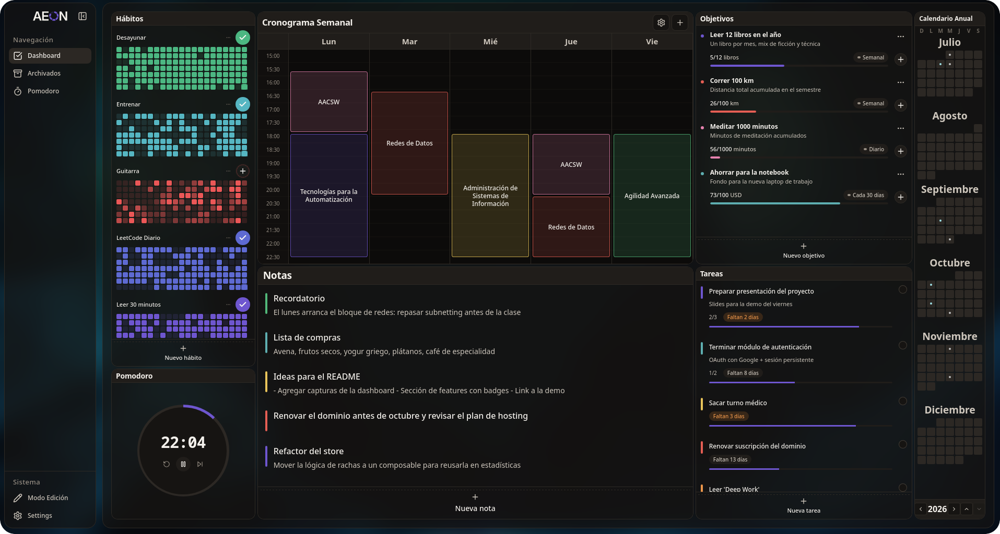

<div align="center">
  <picture>
    <source media="(prefers-color-scheme: dark)" srcset="src/assets/logo/logo-wordmark-white-1024.png">
    
  </picture>
  <p>Dashboard de productividad <strong>local-first</strong> para escritorio.</p>
  
</div>

AEON reúne hábitos, tareas, objetivos, cronograma semanal, calendario anual y pomodoro en un solo dashboard configurable. Tus datos viven en tu máquina: sin cuentas, sin servidores y sin suscripción.

## Descargar

[](https://github.com/ManuCaneva/Habitos/releases/latest)
[](https://github.com/ManuCaneva/Habitos/releases/latest)
[](https://github.com/ManuCaneva/Habitos/releases/latest)
[](https://github.com/ManuCaneva/Habitos/releases/latest)

Los instaladores de cada sistema operativo están en la [página de releases](https://github.com/ManuCaneva/Habitos/releases/latest). La app no está firmada: Windows puede mostrar un aviso de SmartScreen y macOS puede pedir clic derecho → **Abrir** la primera vez.

## Qué incluye

- **Hábitos** — check-in diario, rachas, heatmap y multi-check-in progresivo.
- **Tareas** — estados (todo / doing / done), descripción, color, fecha de vencimiento y sub-tareas.
- **Objetivos** — métricas cuantificables con registro de avance y frecuencia configurable.
- **Cronograma semanal** — bloques por día y franja horaria, con drag & drop.
- **Calendario anual** — los 12 meses en una grilla, con lectura opcional de Google Calendar.
- **Pomodoro** — timer configurable con conteo de sesiones completadas.
- **Dashboard** — grilla de widgets con drag, resize, temas claro / oscuro.

## Stack

Tauri 2 + Rust (rusqlite) como shell de escritorio, Vue 3.5 + TypeScript + Pinia + Zod + Tailwind en el frontend. La lógica de dominio vive en TypeScript; Rust solo persiste en SQLite local.

## Desarrollo

### Prerrequisitos

- **Node.js 20+**
- **Rust estable** (vía [rustup](https://rustup.rs))
- **Linux**: `libwebkit2gtk-4.1-dev`, `build-essential`, `libssl-dev`, `libayatana-appindicator3-dev`, `librsvg2-dev`
- **macOS**: Xcode Command Line Tools (`xcode-select --install`)
- **Windows**: WebView2 (preinstalado en Windows 11) + MSVC build tools

### Puesta en marcha

```sh
git clone https://github.com/ManuCaneva/Habitos.git
cd Habitos
npm install
cp .env.example .env    # opcional, solo si vas a usar Google Calendar
npm run tauri dev
```

La primera compilación de Rust tarda 1–2 minutos; las siguientes son cuestión de segundos.

### Google Calendar (opcional)

La app funciona sin esto. Para conectar una cuenta de Google:

1. Creá un proyecto en [Google Cloud Console](https://console.cloud.google.com/) y habilitá **Google Calendar API**.
2. En **APIs & Services → Credentials**, creá un **OAuth client ID** de tipo **Desktop app**.
3. Copiá `.env.example` a `.env` y completá `VITE_GCAL_CLIENT_ID` y `VITE_GCAL_CLIENT_SECRET` con los valores del cliente.
4. Reiniciá la app y conectá la cuenta desde **Ajustes**.

El `client_secret` de un cliente Desktop **no es confidencial** según la política de Google y viaja embebido en el binario de producción; es el mecanismo esperado para apps instaladas.

### Tests

Este proyecto sigue **TDD estricto**: primero el test, después la implementación. La convención completa está en [AGENTS.md](AGENTS.md).

```sh
npm run test          # suite completa (CI)
npm run test:watch    # modo watch (ciclo TDD)
npm run build         # typecheck + build de producción
npm run test:perf     # presupuesto de rendimiento del dashboard
```

### Releases

Pushear un tag dispara el workflow de GitHub Actions que compila y publica los instaladores (Windows, macOS Intel y Apple Silicon, Linux) en [releases](https://github.com/ManuCaneva/Habitos/releases):

```sh
git tag v1.0.0
git push origin v1.0.0
```

La versión del tag tiene que matchear `version` en `src-tauri/tauri.conf.json`.

## Roadmap

La v1.0.0 incluye todo lo listado en **Qué incluye**, estable en `main`.

**Próximo**

- [ ] Tareas: indicadores de urgencia, tags, prioridades, recurrentes y kanban
- [ ] Calendario integrado (vistas diaria, semanal y mensual)
- [ ] Onboarding, proyectos y notas / journaling

## Licencia

MIT — ver [`LICENSE.txt`](LICENSE.txt).
