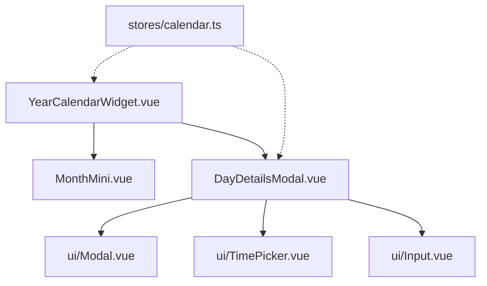

# Design Document: Calendario Anual Interactivo y Sincronización Bidireccional

## 1. Introducción y Requerimientos

El objetivo de este diseño es transformar el calendario anual actual (que solo muestra eventos de Google Calendar en modo lectura) en una herramienta interactiva bidireccional. 

### Requerimientos Clave
1. **Tooltips Precisos:** Al pasar el cursor sobre una celda del calendario anual, se debe mostrar el día y mes correspondiente (ej. `"22 de Julio"`), en lugar del nombre del mes en el contenedor general.
2. **Celdas Clickeables:** Las celdas de días válidos deben ser clickeables y dar feedback visual (cursor pointer, efectos hover).
3. **Modal de Detalles del Día (`DayDetailsModal.vue`):**
   - Mostrar el listado completo de eventos de Google Calendar para el día seleccionado con sus horas, títulos y descripciones.
   - Formulario integrado para crear, editar y eliminar eventos.
   - Selección de calendario destino de entre los calendarios de la cuenta de Google del usuario.
   - Selector de colores nativos de Google Calendar (los 11 colores estándar).
4. **Sincronización Bidireccional (Enfoque A):**
   - Actualización directa mediante peticiones HTTP (POST, PUT, DELETE) contra la API de Google Calendar.
   - Cambio de permisos de OAuth a `https://www.googleapis.com/auth/calendar` para permitir escritura.
   - Actualización inmediata del estado reactivo del store (`events`) ante éxitos en la escritura.
   - Detección de error de permisos insuficientes (403) para guiar al usuario a reconectarse en la pestaña de Ajustes.

---

## 2. Arquitectura de Componentes y Almacenamiento

Se utilizarán y modificarán los siguientes componentes del frontend:

### A. Modificaciones en Esquemas y Helpers
* **[calendar.ts](file:///home/goya/Escritorio/habitos/src/schemas/calendar.ts):**
  - Añadir `description: z.string().optional()` al esquema `CalendarEventSchema`.
  - Añadir `description: z.string().optional()` al esquema `GcalEventItemSchema`.
* **[googleCalendar.ts](file:///home/goya/Escritorio/habitos/src/lib/googleCalendar.ts):**
  - Mapear el campo `description` en `mapGcalEventsToDomain`.
  - Crear helpers para construir URLs de creación, edición y eliminación de eventos en Google Calendar:
    - `buildEventCreateUrl(calendarId: string)`
    - `buildEventUpdateUrl(calendarId: string, eventId: string)`
    - `buildEventDeleteUrl(calendarId: string, eventId: string)`

### B. Modificaciones en el Store (`useCalendarStore`)
* **[calendar.ts](file:///home/goya/Escritorio/habitos/src/stores/calendar.ts):**
  - Modificar `SCOPES` a `"https://www.googleapis.com/auth/calendar"`.
  - Definir `const calendars = ref<{ id: string; summary: string; primary?: boolean; backgroundColor?: string }[]>([])`.
  - Actualizar `syncYear` para rellenar `calendars.value`.
  - Implementar funciones asincrónicas de escritura:
    - `createEvent(calendarId: string, eventData: { title: string; description?: string; colorId?: string; start: string; end: string }): Promise<void>`
    - `updateEvent(calendarId: string, eventId: string, eventData: { title: string; description?: string; colorId?: string; start: string; end: string }): Promise<void>`
    - `deleteEvent(calendarId: string, eventId: string): Promise<void>`
  - Estas funciones realizarán las peticiones HTTP correspondientes. Ante una respuesta exitosa, actualizarán la propiedad reactiva local `events.value` de forma inmediata.

### C. Modificaciones de UI
* **[MonthMini.vue](file:///home/goya/Escritorio/habitos/src/components/calendar/MonthMini.vue):**
  - Remover `:title="monthName"` de la envoltura externa.
  - Implementar la función local `formatTooltipDate(dateStr: string): string` que convierte `"2026-07-22"` a `"22 de Julio"`.
  - Agregar `:title="cell.date ? formatTooltipDate(cell.date) : undefined"` a `.day-cell`.
  - Agregar `@click="cell.date && emit('select-day', cell.date)"` y estilos condicionales (`cursor-pointer hover:ring-2 hover:ring-primary/50`).
* **[YearCalendarWidget.vue](file:///home/goya/Escritorio/habitos/src/components/dashboard/YearCalendarWidget.vue):**
  - Capturar `@select-day` en `<MonthMini>` y vincularlo a un estado local `selectedDate`.
  - Renderizar `<DayDetailsModal :open="showDayModal" :date="selectedDate" @close="showDayModal = false" />`.

---

## 3. Flujo de Datos

### Sincronización y Lectura
1. Al cargar la app o cambiar de año, se llama a `syncYear()`.
2. Se consulta la lista de calendarios (`/users/me/calendarList`). Se guardan en `store.calendars`.
3. Se consultan los eventos de todos los calendarios y se agrupan en `store.events`.
4. El widget de calendario renderiza los meses y resalta los días con puntos según la fecha del evento.

### Escritura (Ejemplo: Crear Evento)
1. El usuario hace clic en el día `2026-07-22` -> se abre `DayDetailsModal`.
2. Hace clic en "Agregar Evento", completa el formulario (título, descripción, hora de inicio/fin, calendario destino, color) y presiona "Guardar".
3. Se invoca `store.createEvent(calendarId, eventData)`.
4. Se hace la llamada HTTP `POST` a la API de Google Calendar.
5. **Si tiene éxito (200 OK):**
   - La API de Google retorna el objeto del nuevo evento creado.
   - El store mapea esta respuesta al modelo interno y lo empuja a `events.value`.
   - Se cierra la vista del formulario en el modal y se muestra la lista actualizada.
6. **Si falla con 403 (Permisos):**
   - Se captura el error y se muestra el banner de advertencia para guiar al usuario a reconectarse desde Ajustes.

---

## 4. Estrategia de Tests (TDD Estricto)

Cumpliendo con la **Metodología TDD Estricto** del proyecto, se crearán/modificarán los siguientes archivos de pruebas unitarias:

1. **`src/schemas/calendar.test.ts` / `src/lib/googleCalendar.test.ts`:**
   - Probar que el mapeo y parsing con Zod acepte y procese el campo `description`.
   - Probar la generación de URLs de escritura.
2. **`src/stores/calendar.test.ts`:**
   - Mockear `fetch` de `@tauri-apps/plugin-http` para las APIs de Google.
   - Escribir tests para `createEvent`, `updateEvent` y `deleteEvent`.
   - Validar que al tener éxito, modifiquen correctamente la lista reactiva de `events.value`.
   - Validar el manejo correcto de errores 403 (devolviendo una excepción específica).
3. **`src/components/calendar/MonthMini.test.ts`:**
   - Validar que las celdas con fecha tengan el tooltip correspondiente (ej. `"22 de Julio"`).
   - Validar que al hacer clic en una celda válida, se emita el evento `'select-day'` con la fecha correcta.
4. **`src/components/dashboard/DayDetailsModal.test.ts`:**
   - Validar el renderizado condicional de los eventos del día.
   - Validar el envío de formularios de creación, edición y el flujo de eliminación.
